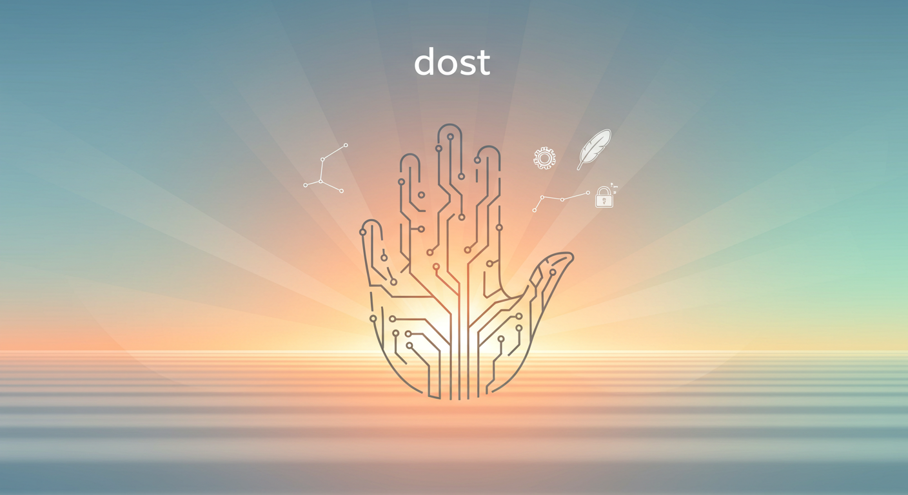

# dost: Your Open-Source, Self-Hostable, and Unrestricted AI Chat Companion

**dost** (Turkish for "friend") is an open-source, self-hostable web UI for Large Language Models (LLMs), built for privacy, flexibility, and a 100% open-source future. It is inspired by the feature-richness of platforms like Open WebUI but is committed to remaining truly open and community-driven under the permissive **MIT License**, forever.

This project was born out of the belief that powerful AI tools should be accessible to everyone without proprietary restrictions or branding clauses. `dost` is for developers, hobbyists, and organizations who want full control over their AI interactions and data.



## Core Philosophy

*   **Truly Open & Unrestricted:** Licensed under MIT. No clauses, no exceptions. You can fork, modify, rebrand, and use `dost` for any purpose, commercial or personal.
*   **Backend-Agnostic:** Designed to connect to a variety of LLM providers, including Ollama, OpenAI-compatible APIs (like Groq, Fireworks, or local servers), and more.
*   **Full Data Ownership:** Self-host everything. Your conversations, user data, and settings stay on your infrastructure.
*   **Community-Driven:** Built with the community, for the community. Contributions, suggestions, and forks are highly encouraged.

---

## Core Features (Roadmap Goals)

-   ✅ **Rich & Responsive Interface:** A clean, intuitive UI with full Markdown, LaTeX, and code syntax highlighting. Fully responsive and PWA-enabled.
-   ✅ **Advanced Theming:** Includes Light, Dark, and OLED modes, with options for custom backgrounds and system-preference auto-switching.
-   ✅ **Multi-Model Support:** Seamlessly switch between different LLM models and adjust parameters (e.g., temperature, seed) for any conversation.
-   ✅ **Streaming & Real-time Responses:** See the model "think" with real-time token streaming.
-   ✅ **Advanced Chat Management:** Conversation history, searching/filtering, pinning, and branching.
-   ✅ **Retrieval-Augmented Generation (RAG):**
    -   **Document Chat:** Upload PDFs, TXT, and other files to chat with your documents.
    -   **Web Search:** Augment conversations with real-time web search results.
-   ✅ **Multi-Modal Interaction:**
    -   **Voice I/O:** Support for push-to-talk voice input and text-to-speech (TTS) for responses.
    -   **Image Generation:** Integrate with models like DALL-E or Stable Diffusion.
-   ✅ **Tools & Function Calling:** A framework for giving models access to external tools (e.g., calculators, APIs), with a GUI for management.
-   ✅ **Live Artifacts & Jupyter Integration:** Render and interact with HTML/CSS/JS code blocks in real-time; optional integration with a Jupyter backend for code execution.
-   ✅ **Secure Multi-User System:**
    -   **User Authentication:** Standard user registration and login.
    -   **Role-Based Access Control (RBAC):** Admin panel for managing users, roles, and permissions.
-   ✅ **Easy Deployment:** Fully containerized with Docker for a simple, one-command setup.

---

## Technology Stack & Architecture

`dost` uses a modern, decoupled architecture that separates the user interface from the backend logic. This allows for scalability and lets us use the best tools for each job.

```
+------------------------+      +-------------------------+      +-----------------------+
|   Frontend (Client)    |      |    Backend API Server   |      |   External Services   |
|   (SvelteKit + Vite)   |      |     (Python + FastAPI)  |      |                       |
+------------------------+      +-------------------------+      +-----------------------+
| - UI Components        |      | - /api/chat (streaming) | <--> | - Ollama              |
| - State Management     |      | - /api/users (auth)     | <--> | - OpenAI API          |
| - Real-time Updates    |      | - /api/rag (documents)  | <--> | - Groq, Fireworks etc.|
+------------------------+      | - /api/tools            |      +-----------------------+
        |                       | - Auth Middleware       |                  ^
        |                       | - RAG Logic             |                  |
        |                       +-------------------------+                  |
        v                                     |                              |
[ Browser ]                                   v                              |
                                  +-----------------------+                  |
                                  |   Database Storage    | -----------------+
                                  | (PostgreSQL+PGVector) |
                                  +-----------------------+
                                  | - Users, Roles        |
                                  | - Conversations       |
                                  | - Vector Embeddings   |
                                  +-----------------------+
```

*   **Frontend:**
    *   **Framework:** [SvelteKit](https://kit.svelte.dev/)
    *   **Language:** [TypeScript](https://www.typescriptlang.org/)
    *   **Styling:** [Tailwind CSS](https://tailwindcss.com/)
    *   **State Management:** Svelte Stores
*   **Backend:**
    *   **Framework:** [FastAPI](https://fastapi.tiangolo.com/) (Python)
    *   **Language:** [Python 3.11+](https://www.python.org/)
    *   **Data Validation:** [Pydantic](https://docs.pydantic.dev/)
*   **Database:**
    *   **Primary:** [PostgreSQL](https://www.postgresql.org/) for relational data (users, chats).
    *   **Vector Store:** [PGVector](https://github.com/pgvector/pgvector) extension for efficient similarity search in RAG.
    *   **Migrations:** [Alembic](https://alembic.sqlalchemy.org/en/latest/) for database schema management.
*   **Containerization:**
    *   **Orchestration:** [Docker Compose](https://docs.docker.com/compose/) for easy local development and deployment.

---

## The Development Roadmap: A Granular, UI-First Plan

This project will be built "UI-first". We will create the entire frontend application using mocked data and simulated interactions. Once the user experience is complete and polished, we will build the backend API and swap out the mock data for real API calls.

### **Module 1: Building the Complete Frontend UI (Phases 1-10)**
*Goal: A beautiful, interactive, and feature-rich frontend that feels like a real application, powered entirely by local, mock data.*

-   [x] **Phase 1: Project & UI Foundation:** Initialize SvelteKit/FastAPI monorepo. Build the static chat UI layout with a sidebar and main content area using Tailwind CSS.
-   [x] **Phase 2: Core Chat Interactivity:** Implement Svelte stores for state management. Make the chat input functional (add messages, simulate responses) using local state.
-   [x] **Phase 3: Rich Content & Markdown:** Integrate `marked` and a syntax highlighting library (`highlight.js`) to render LLM responses with proper Markdown, code blocks, and other formatting.
-   [x] **Phase 4: Conversation History UI:** Build the UI for managing multiple chats. Create a `ChatHistory` component in the sidebar that displays a list of mock conversations. Make them clickable.
-   [x] **Phase 5: Dynamic Routing & Chat Pages:** Implement SvelteKit's dynamic routing (`/c/[id]`). When a user clicks a mock conversation in the sidebar, they are navigated to a unique page for that chat, which displays its specific (mocked) message history.
-   [x] **Phase 6: Advanced Chat Controls:** Build the UI components for advanced interactions: "Copy Message", "Regenerate Response", "Edit Message", and "Delete Message". Add mock functionality to them (e.g., updating the Svelte store).
-   [x] **Phase 7: The Settings & Profile Page:** Create a `/settings` page with multiple tabs (Profile, Interface, Models). Build all the UI controls (text inputs, toggles, dropdowns) with no backend logic.
-   [ ] **Phase 8: The Document Management UI (RAG):** Create a `/documents` page where users can see a list of their uploaded files. Build the UI for the file upload component (it won't actually upload yet). Add UI elements to the chat input to "attach" a mock document to a conversation.
-   [ ] **Phase 9: The Admin Panel UI:** Create an `/admin` area with pages for User Management, System Settings, and Model Management. Build the tables and forms to display and edit mock data.
-   [ ] **Phase 10: The Login/Register UI:** Create the authentication pages (`/login`, `/register`). Build the forms, but have them lead to a successful "mock" login that just navigates the user to the main chat page.

---
### **Module 2: Building the Backend API (Phases 11-16)**
*Goal: A robust, secure, and powerful FastAPI backend that provides all the necessary data and logic for the frontend.*

-   [ ] **Phase 11: Backend & Database Foundation:** Set up the FastAPI server, PostgreSQL database (with Docker), and Alembic for migrations. Create the initial `users`, `conversations`, and `messages` tables.
-   [ ] **Phase 12: Core Chat & Model API:** Create the first real API endpoint: `/api/v1/chat`. This endpoint will take a message history, connect to a real LLM provider (e.g., Ollama, OpenAI), and stream the response back.
-   [ ] **Phase 13: User Authentication & Persistence API:** Implement JWT-based authentication (`/auth/register`, `/auth/login`). Create API endpoints for creating, retrieving, and listing conversations, all associated with the authenticated user.
-   [ ] **Phase 14: Document Processing & RAG API:** Implement the backend logic for file uploads. Use `pypdf` to extract text, `sentence-transformers` for embeddings, and `pgvector` for storage. Create the RAG-enabled chat endpoint that retrieves context before calling the LLM.
-   [ ] **Phase 15: Advanced Backend Logic:** Implement the API endpoints for the Admin Panel (e.g., listing/editing users) and the Settings pages (e.g., saving user preferences).
-   [ ] **Phase 16: Tooling & Configuration:** Build the backend system for defining and managing different LLM models from a config file. Implement the server-side logic for "regenerating" responses or editing message history.

---
### **Module 3: Connecting Frontend to Backend (Phases 17-20)**
*Goal: Systematically replace all mock data and functions in the SvelteKit app with live calls to the FastAPI backend.*

-   [ ] **Phase 17: Connecting Login & Chat:** Replace the mock authentication with calls to the real `/auth` endpoints. Swap the simulated chat response with a real `fetch` call to the streaming `/api/v1/chat` endpoint.
-   [ ] **Phase 18: Connecting Conversation History:** Rip out the mocked conversation list and replace it with a live API call in a `+layout.server.ts` file to fetch the user's real conversations from the database. Make navigation work with real conversation IDs.
-   [ ] **Phase 19: Connecting Documents & Settings:** Wire up the document upload UI to the real file upload endpoint. Make the settings page fetch and save user preferences to the backend.
-   [ ] **Phase 20: Final Polish & Deployment:** Create a final, production-ready `docker-compose.yml` to orchestrate the entire stack. Clean up any remaining mock code, write documentation, and finalize the project.

---

## Contributing

Contributions are the lifeblood of open source. If you're excited about the vision for `dost`, your help is welcome! Please feel free to open an issue to discuss a bug or feature, or submit a pull request.

## License

This project is distributed under the **MIT License**. See the `LICENSE` file for more information. You are free to use, modify, and distribute this software for any purpose, with no requirement to preserve branding.